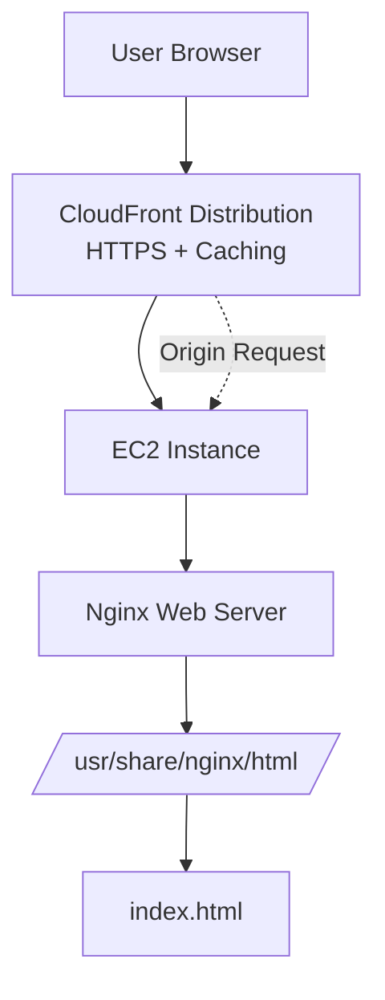
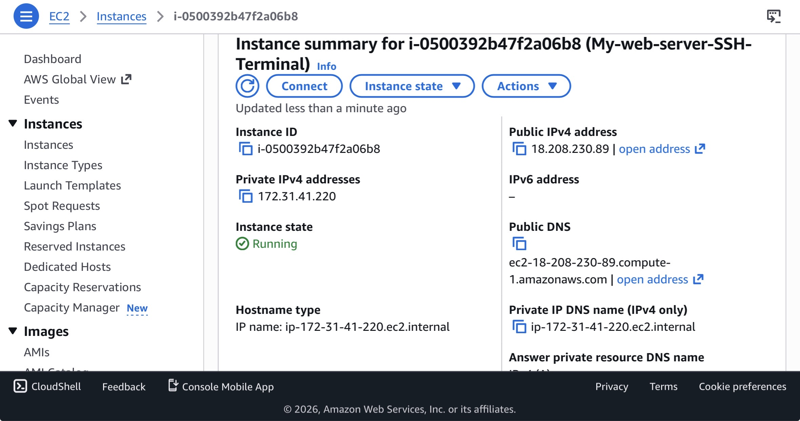
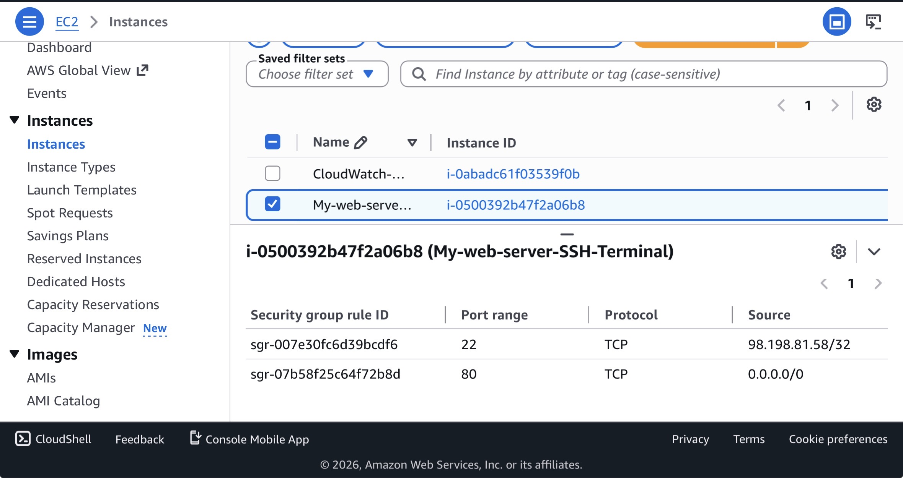
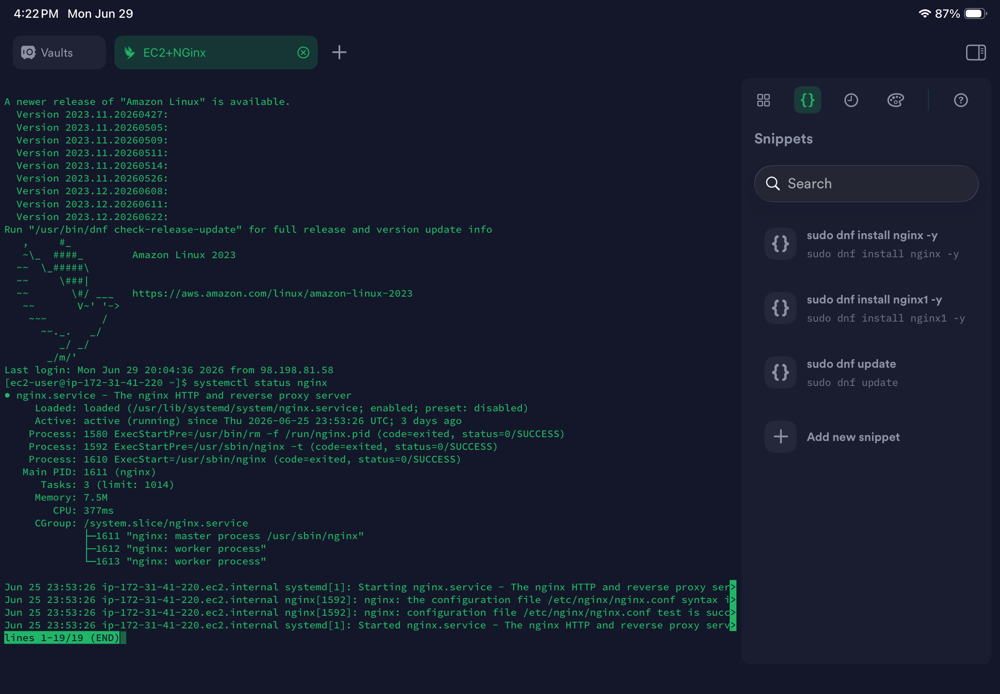
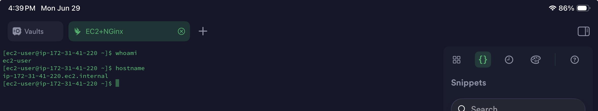
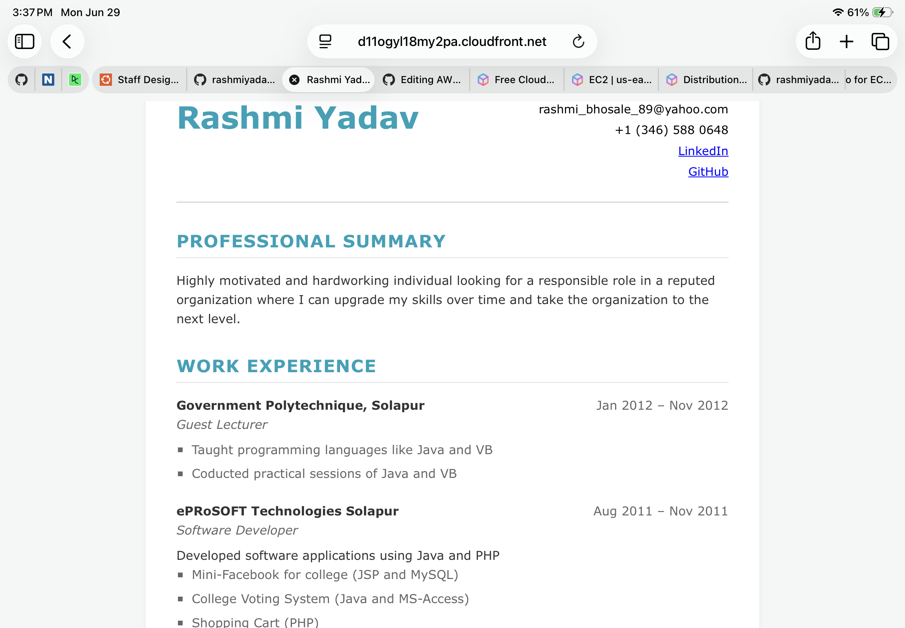

# AWS-Resume-Website-Deployment-Using-EC2-Nginx-Cloudfront

## Project Overview
This project demonstrates hosting a personal resume website using AWS EC2 with Nginx as a web server and CloudFront for secure global content delivery (HTTPS + CDN optimization).

## Tech Stack
- AWS EC2 (Amazon Linux)
- Nginx Web Server
- AWS CloudFront (CDN)
- HTML, CSS (Static Resume Website)

## Architecture



## Features
- Deployed static resume website on EC2
- Configured Nginx for serving static files
- Enabled HTTPS access via CloudFront
- Secure and scalable hosting setup

## Implementation Steps
**Step 1:** Launch EC2 instance.   
Create instance (Amazon Linux 2/2023)    
Allow HTTP (80) and SSH (22) in Security Group    
**Step 2:** Install & Start Nginx  
Installed Nginx on Amazon Linux using dnf.  
Started and enabled Nginx service.    
**Step 3:** Deploy Website Files  
Navigated to /usr/share/nginx/html/ directory.  
Uploaded index.html.    
Restarted Nginx service.    
**Step 4:** Test EC2 Deployment  
Accessed website using EC2 Public IP.  
Verified Nginx default server was serving custom site.  
**Step 5:** Configure CloudFront  
Created CloudFront distribution.  
Selected EC2 Public DNS as custom origin.  
Enabled HTTPS redirect and caching.  
**Step 6:** Deploy & Access Website  
Waited for CloudFront deployment to complete.  
Accessed website using CloudFront domain URL.  

## Security Best Practices  
-Restrict EC2 Security Group (SSH only from your IP, limit HTTP access)  
-Use CloudFront as the main entry point, avoid direct EC2 access  
-Disable Nginx directory listing and hide server version  
-Use SSH key-based authentication only, protect .pem file  
-Enable HTTPS via CloudFront and force HTTP → HTTPS redirect  

## Screenshots:    

### EC2 Instance Running 



### Security Group Configuration



### Nginx Service Running



### SSH Connection to EC2



### Website Homepage

  

## Project Outcome
-Successfully hosted my resume on EC2  
-Configured Nginx web server on Amazon Linux  
-Integrated CloudFront for CDN + HTTPS  
-Improved website performance and security  

## Skills Demonstrated
-AWS EC2 & Security Groups  
-Nginx Web Server Configuration  
-CloudFront CDN Setup  
-Linux Server Management  
-Static Website Hosting  

## Repository Structure: 

```text
 
AWS-Resume-Website-Deployment-Using-EC2-Nginx-Cloudfront/
│
├── index.html
│
├── screenshots/
│   ├── SSH-connection-to-ec2.jpeg
│   ├── ec2-running-status.jpeg
│   ├── ec2-security-group.jpeg
│   ├── nginx-service-running.png
│   ├── website-homepage.png
── README.md


